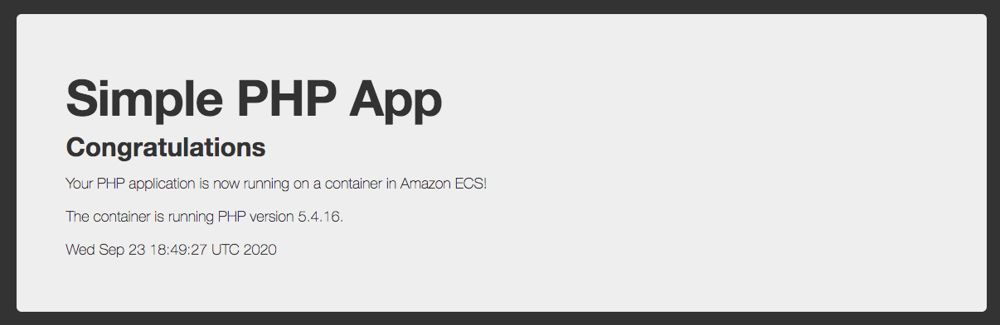

# What I Did

Here's what I did.

0. Forked the [ecs-demo-php-simple-app](https://github.com/awslabs/ecs-demo-php-simple-app) repo.

1. Forked the [ecs-refarch-continuous-deployment](https://github.com/awslabs/ecs-refarch-continuous-deployment) repo.

2. Cloned the forked ecs-refarch-continuous-deployment repo on my local.

3. In GitHub, [created a new personal access token](https://docs.github.com/en/github/authenticating-to-github/creating-a-personal-access-token) called test-ecs-refarch-continuous-deployment, with 'repo' scope.

4. Created an S3 bucket.

5. Uploaded the [templates/](./templates/) directory to the S3 bucket.

6. Created the following environment variables.

  TEST_ECS_REFARCH_CONTINUOUS_DEPLOYMENT_TOKEN = the newly created test-ecs-refarch-continuous-deployment token
  TEST_ECS_REFARCH_CONTINUOUS_DEPLOYMENT_S3_BUCKET = the name of the S3 bucket created in step 4

7. Created a Python virtual environment, and installed requirements.txt in it.
```
mkvirtualenv ecs-refarch-env
pip install -r requirements.txt
```

8. Inside the ecs-refarch-env Python virtual environment, ran this.
```
aws cloudformation deploy --template-file ecs-refarch-continuous-deployment.yaml --stack-name test-ecs-refarch-continuous-deployment \
--capabilities CAPABILITY_NAMED_IAM --region $AWS_DEFAULT_REGION \
--parameter-overrides GitHubUser=Charbeneau \
GitHubToken=$TEST_ECS_REFARCH_CONTINUOUS_DEPLOYMENT_TOKEN \
TemplateBucket=$TEST_ECS_REFARCH_CONTINUOUS_DEPLOYMENT_S3_BUCKET
```

9. CloudFormation Console > Stacks > test-ecs-refarch-continuous-deployment > Resources > Outputs > ServiceUrl

Click on the URL, and you should see this.


10. Cloned my fork of the [ecs-demo-php-simple-app](https://github.com/awslabs/ecs-demo-php-simple-app) repo to my local.

11. Made a small change to src/index.php in the ecs-demo-php-simple-app repo, changing the "." at the end of line 20 to a "!", and committed and pushed the change to the master branch.

12. CloudFormation Console > Stacks > test-ecs-refarch-continuous-deployment > Outputs > PipelineUrl

Click on the URL, follow the Source - Build - Deploy pipeline, and look for "Deploy Succeeded" at the bottom.

![codepipeline][./images/codepipeline.png]

13. CloudFormation Console > Stacks > test-ecs-refarch-continuous-deployment > Outputs > ServiceUrl.

Click on the URL. You should see the change.


